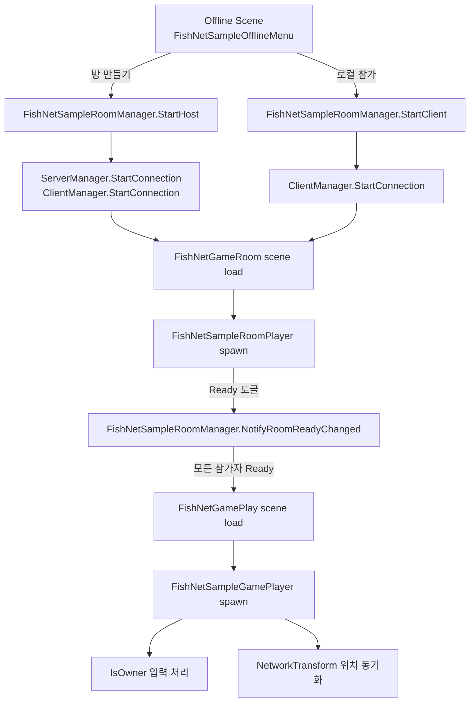
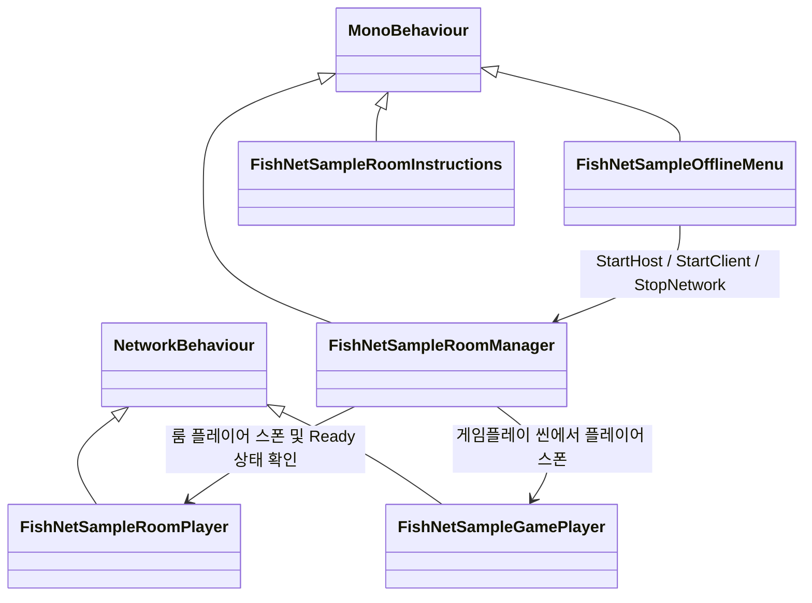

# FishNetSample 객체 구조 요약

이 디렉토리는 FishNet 기반 룸/게임플레이 샘플 네트워크 흐름을 위한 5개 C# 컴포넌트로 구성되어 있습니다.
FishNet에는 별도의 내장 RoomManager가 없으므로, 프로젝트의 `FishNetSampleRoomManager`가 오프라인 → 룸 → 게임플레이 전환을 직접 관리합니다.

```text
00_FishNetSample
├─ FishNetSampleOfflineMenu.cs       // 오프라인 메뉴: 방 만들기/참가/중지
├─ FishNetSampleRoomManager.cs       // FishNet 연결, 씬 로드, 플레이어 스폰 관리
├─ FishNetSampleRoomPlayer.cs        // 로비/룸 참가자와 Ready 상태
├─ FishNetSampleGamePlayer.cs        // 실제 게임 씬 플레이어
└─ FishNetSampleRoomInstructions.cs  // 화면 안내문 UI
```

## 전체 흐름 다이어그램



## 클래스 관계 다이어그램



## 객체별 설명

### 1. `FishNetSampleOfflineMenu`

역할: 처음 화면에서 네트워크 시작 버튼을 제공하는 메뉴입니다.

주요 기능:

```text
방 만들기        → FishNetSampleRoomManager.StartHost()
로컬호스트 참가  → FishNetSampleRoomManager.StartClient()
네트워크 종료    → FishNetSampleRoomManager.StopNetwork()
```

현재 `방 만들기`는 데디케이트 서버가 아니라 호스트 모드입니다.
호스트 모드는 같은 프로세스에서 서버와 클라이언트를 함께 실행합니다.

```text
방장 = 서버 + 클라이언트
```

### 2. `FishNetSampleRoomManager`

역할: FishNet 연결 시작/종료, 네트워크 씬 로드, 룸 플레이어 및 게임 플레이어 스폰을 관리하는 핵심 매니저입니다.

담당 흐름:

```text
FishNetOffline Scene
 → FishNetGameRoom Scene
 → FishNetGamePlay Scene
```

주요 책임:

```text
ServerManager.StartConnection()
ClientManager.StartConnection(address)
SceneManager.LoadConnectionScenes(...)
ServerManager.Spawn(networkObject, ownerConnection)
```

모든 `FishNetSampleRoomPlayer`가 Ready 상태가 되면 게임플레이 씬으로 넘어갑니다.

### 3. `FishNetSampleRoomPlayer`

역할: 게임 시작 전 로비/룸에 있는 참가자 슬롯입니다.

상속 구조:

```csharp
NetworkBehaviour
```

이 객체는 실제 전투나 이동을 담당하는 플레이어가 아니라 Ready 상태를 가진 로비 참가자입니다.
소유 클라이언트만 Ready 입력을 보낼 수 있도록 `IsOwner` 기준으로 입력을 제한합니다.

```text
로비 참가자 슬롯
```

### 4. `FishNetSampleGamePlayer`

역할: 게임플레이 씬에서 실제로 움직이는 플레이어입니다.

상속 구조:

```csharp
NetworkBehaviour
```

주요 기능:

```text
소유자 클라이언트만 입력 받음
WASD / 방향키 이동
카메라를 자기 캐릭터에 붙임
플레이어 이름을 네트워크로 동기화
로컬/원격 플레이어 색상 다르게 표시
```

중요한 조건:

```csharp
if (!IsOwner)
{
    return;
}
```

이 조건 때문에 내가 소유한 플레이어만 입력을 처리합니다.

### 5. `FishNetSampleRoomInstructions`

역할: 화면에 간단한 안내문을 표시하는 보조 컴포넌트입니다.

상속 구조:

```csharp
MonoBehaviour
```

네트워크 로직은 없고 `OnGUI()`로 안내문만 표시합니다.

```text
FishNet 게임룸
Ready 버튼 안내
모든 플레이어 준비 시 게임플레이 씬 이동 안내
```

## 핵심 요약

```text
FishNetSampleOfflineMenu
    ↓ 방 만들기 / 참가
FishNetSampleRoomManager
    ↓ 연결 시작, 룸 씬 로드, 룸 플레이어 스폰
FishNetSampleRoomPlayer
    ↓ Ready 완료
FishNetSampleRoomManager
    ↓ 게임플레이 씬 로드, 게임 플레이어 스폰
FishNetSampleGamePlayer
    ↓ 실제 게임 플레이어 생성/이동
FishNetSampleRoomInstructions
    → 안내문 표시용 보조 컴포넌트
```

현재 구조는 호스트/클라이언트 룸 샘플이고, 별도 데디케이트 서버 자동 시작 진입점은 아직 따로 없습니다.
