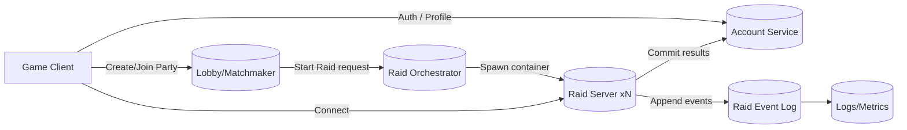

# 서버 권위 데디케이트 서버 기반 탑다운 로그라이크 익스트랙션 프로젝트 검증 및 MVP 설계 보고서

## Executive Summary

본 프로젝트는 “탑다운 익스트랙션(레이드 세션) + 로그라이크식 런(raid)별 빌드 폭발 + 서버 권위(전투/인벤토리/결과 저장) + Docker 멀티 인스턴스 운영”을 통해 **네트워크 설계·보안(치트)·운영 역량을 동시에 포트폴리오로 증명**하려는 목표에 구조적으로 적합하다. 권위 서버 모델은 클라이언트가 입력(의도)만 보내고 서버가 월드를 시뮬레이션해 결과를 확정하는 방식으로 요약되며, 빠른 멀티플레이에서 치트 저항성과 일관성 확보를 위해 널리 쓰이는 접근이다. citeturn14search11turn1search2

제안된 로그라이크 요소(레이드 내 선택 보상, 시너지 패시브, 저주/리스크-보상, 메타 해금, 환경 랜덤화, 상태이상 중심 빌드)는 **대부분 네트워크 비용이 낮고 서버 권위로 안전하게 관리**할 수 있다. 특히 “선택형 특성 + 태그 기반 시너지 + 저주(디버프)와 보상 교환”은 서버가 관리해야 할 핵심 데이터가 **정수/태그 집계 수준**이라, 위치/전투 동기화에 비해 대역폭·동기화 리스크가 작다(서버 확정 이벤트만 전파). citeturn14search0turn3view2

다만 MVP(4~6개월, 1인)에서 가장 큰 위험은 “빌드 시스템 자체”보다 **전투/이동의 네트워크 체감(틱·스냅샷·보간)과 인벤토리 트랜잭션의 무결성(중복/경합/재시도/크래시 복구)**이다. 실시간 네트워크 이동은 틱·스냅샷·보간·패킷 손실 대응까지 함께 검증해야 하므로 직접 알고리즘을 새로 만들기보다 FishNet의 TimeManager, NetworkTransform, Observer/AOI 계층을 먼저 활용하고 게임 규칙/트랜잭션/로그 설계에 시간을 배분하는 전략이 안전하다.

운영·배포 측면에서 Unity의 Dedicated Server 빌드는 데스크톱 헤드리스와 유사하되 네트워크 애플리케이션 실행에 맞춰 CPU·메모리 최적화(스트리핑 등)를 목표로 한다. 커맨드라인 `-standaloneBuildSubtarget Server`로 Linux 서버 빌드를 자동화할 수 있어 CI/Docker 파이프라인과 결합하기 좋다. citeturn13search10turn13search18turn13search23

요약 권고는 다음과 같다. (1) 런 내 “선택형 특성”은 5~8회 획득으로 제한하고, 복합 판정(폭발/연쇄/장판)은 소수만 둔다(서버·밸런스 리스크 절감). (2) 시너지는 “태그 집계형(2단계 임계치)”로 설계해 로그라이크 감각을 높이되 네트워크 부담을 유지한다. (3) 저주/리스크-보상은 “정량 배율”보다 “확정 보상/전용 보상 테이블” 중심이 경제 밸런싱에 유리하다. (4) 인벤토리는 이벤트 소싱 형태의 로그(append-only)로 남겨 재현성과 운영 디버깅 가치를 확보한다. citeturn8search2turn12search9

## 요구사항 검증 매트릭스

아래 매트릭스는 각 제안 기능을 **구현 가능성(서버 권위/데디서버)**, **네트워크 비용**, **보안/치트 관점**, **밸런스 리스크**로 검증한 것이다. FishNet은 기본적으로 서버 권위이며(서버가 모든 결정을 내림), Interest Management 및 SyncMode로 클라이언트에 전송되는 정보를 최소화하는 것이 치트 대응의 핵심 축임을 명시한다. citeturn12search9turn12search0turn8search21

| 제안 기능 | 서버 권위 구현 가능성 | 네트워크 비용 | 보안(치트) 관점 | 밸런스 리스크 | 결론 |
|---|---|---|---|---|---|
| 레이드 내 빌드 폭발(전투 후 3지선다 보상) | 매우 높음: “선택”은 서버가 확정하고 클라엔 결과만 브로드캐스트하면 됨(입력→서버결정→스냅샷) citeturn1search2turn14search0 | 낮음: 특성 ID/레벨/스택 정도만 동기화 | 높음: 서버가 선택·효과를 소유하면 클라 조작 여지 작음 citeturn12search9 | 중간: 특성 풀·등장률·중첩으로 런 파워가 폭주 가능 | **필수 채택**(단, “복합 판정 특성” 수를 제한) |
| 시너지 기반 패시브 조합(태그 집계) | 매우 높음: 서버가 태그 카운트로 조건 충족 판단 후 발동 플래그만 유지 | 매우 낮음: 태그/시너지 상태만 공유 | 매우 높음: 조합 조건·발동을 서버가 계산하면 조작이 어려움 | 중간: 특정 조합이 압도적으로 강해지는 메타 고착 가능 | **필수 채택**(임계치 2단계 권장) |
| 저주/리스크-보상(강한 특성+랜덤 디버프) | 높음: “보상/저주”는 서버가 RNG+시드로 확정하고 기록 가능(런 단위) | 낮음: 저주 ID/파라미터만 동기화 | 높음: 보상 룰/저주 적용이 서버 권위면 치트 저항 | 높음: 경제·난이도 곡선이 급변할 수 있음 | **선택-필수 경계**(MVP는 3종 이내, 보상은 정량 배율 대신 확정 보상 권장) |
| 메타 해금(선택지 확장 중심) | 매우 높음: 영속 프로필 서비스(계정/해금 테이블)에서 서버가 제어 | 매우 낮음: 로비/프로필 동기화 중심 | 매우 높음: 해금은 전적으로 서버 DB 권한으로 통제 | 낮음~중간: 성능 상승으로 치우치면 MMO화 | **권장**(“선택지 확장”만 채택) |
| 환경 상호작용 랜덤화(정전/독가스/화재 등) | 높음: 서버가 시드로 결정, 상태 머신만 권위 있게 운용 | 낮음~중간: 환경 존 상태(활성/강도/타이머) 전파 필요 | 높음: 클라는 결과 렌더링만, 판정은 서버 | 중간: RNG가 억울함 유발 가능 | **권장**(MVP는 2종부터) |
| 탑다운 특화 상태이상 중심 빌드(출혈/화염/감전/소음 암살) | 매우 높음: 상태이상은 서버 틱에서 디버프 틱/중첩만 계산하면 됨(FishNet/권위 서버 틱과 합) citeturn3view3turn14search0 | 낮음: 상태이상 스택/타이머만 전파 | 매우 높음: 피해·판정을 서버 권위로 고정 가능 citeturn12search9turn14search3 | 중간: 상태이상 간 상호작용이 복잡해지면 폭주 | **필수 채택**(탑다운에서 체감이 좋고 네트워크 비용이 낮음) |

## 유사 장르·사례 리서치

본 섹션은 “시너지/런 중 폭발적 성장/저주 시스템/선택형 리스크·보상/익스트랙션 긴장”이 **검증된 상업 사례에서 어떻게 반복 활용되는지**를 1차(공식) 자료 중심으로 요약한다.

image_group{"layout":"carousel","aspect_ratio":"16:9","query":["Hades boon selection screen screenshot","Slay the Spire relic and cards screenshot","Risk of Rain 2 items stacking screen","Escape from Tarkov extraction screenshot"],"num_per_query":1}

### 런 중 선택과 폭발적 성장

Hades는 “매번 탈출 시도(escape attempt)마다 더 강해지며 스토리가 진행된다”는 런 기반 성장 구조를 공식 스토어 설명에서 강조한다. citeturn2search3 또한 entity["organization","Supergiant Games","game studio, san francisco, us"]의 공식 FAQ/블로그는 게임 내 난이도·도전 구조(예: God Mode, Hell Mode, Pact of Punishment)를 “플레이어가 선택해 난이도를 조정하고 보상을 얻는” 철학으로 설명한다. citeturn11search0turn11search2 이 패턴은 “레이드 중 선택형 특성”을 통해 런 정체성을 만드는 제안과 구조적으로 동일하다(선택→런 변주→재플레이). citeturn2search3turn11search0

Slay the Spire는 공식 스토어에서 “카드와 로그라이크를 결합한 덱빌딩”을 전면에 두고, 수백 장의 카드 선택과 유물(Relic)의 상호작용으로 “서로 잘 어울리는 조합”을 만들며, 위험한 길/안전한 길의 선택이 달라지고 유물 획득에는 “골드 이상의 대가”가 필요할 수도 있다고 명시한다. citeturn6search8turn6search0 즉 “런 중 선택(카드/경로/유물) → 시너지 형성 → 리스크-보상”이 공식 소개 문구 자체에 들어 있는 구조다. citeturn6search8

또한 entity["organization","Mega Crit","game studio, us"]의 개발자 뉴스레터(Neowsletter)는 Slay the Spire 2에서 “Enchantments”를 **해당 런 동안 적용되는 카드 수정자**로 소개하며, “런을 규정(run-defining)할 수 있는 강력한 Enchantment는 희소 이벤트 등에서 발견된다”고 설명한다. citeturn10search3turn6search6 이는 “엘리트 처치/이벤트 성공 후 3지선다 특성”처럼, **리스크를 치른 지점에서 런의 방향을 바꾸는 강한 선택지를 주는 디자인**이 메타적으로 타당함을 뒷받침한다. citeturn10search3

### 시너지(조합)와 스택이 만드는 빌드 정체성

Risk of Rain 2의 공식 스토어 페이지(한국어)는 아이템이 110종 이상이며, “아이템을 많이 수집할수록 효과들을 섞어 사용할수록 놀라운 복합 효과가 일어날 수 있다”고 명시한다. citeturn2search1 이는 “태그 기반 시너지(출혈 3개↑, 이동계 2개↑ 등)”의 정당성을 강화한다. 즉, 복합 효과는 네트워크 비용이 아니라 **규칙 설계(조합 룰)와 밸런스(상호작용 한계선)**의 문제이며, 상업 사례는 이를 “핵심 재미 축”으로 활용해 왔다. citeturn2search1

### 저주/리스크-보상 구조

Hades의 “Pact of Punishment”는 entity["organization","Supergiant Games","game studio, san francisco, us"] 공식 업데이트 게시글에서 “가치 있는 보상을 위해, 얼마나 ‘나쁜(가혹한) 조건’을 받아들일 것인가”라는 문장으로 요약된다. citeturn11search2turn11search3 이는 제안된 “저주 시스템(강한 특성 + 디버프)”과 동형이다. 중요한 것은 “디버프가 단지 페널티가 아니라, 보상을 열기 위한 플레이어 선택”으로 기능한다는 점이다. citeturn11search2

Slay the Spire는 공식 소개에서 유물 획득에 “골드 이상의 대가”가 필요할 수 있음을 명시해, 보상 선택이 곧 리스크 선택일 수 있음을 강조한다. citeturn6search8 MVP에서 “상자 열기(강한 특성 + 디버프)”나 “고위험 탈출(전용 보상)”이 작동하려면, 리스크가 **가시적이고 이해 가능한 규칙**이어야 한다는 점을 시사한다. citeturn6search8turn11search2

### 익스트랙션의 ‘탈출이 전부를 결정’하는 긴장

Escape from Tarkov의 공식 스토어 설명은 “모든 레이드는 죽음이 걸린 도박이며, 전리품을 움켜쥐고 버티다가 ‘탈출(extraction)’만이 살거나 모든 것을 잃을지를 결정한다”고 요약한다. citeturn7search11 이 한 문장이 “안전 탈출(보상 70%) vs 고위험 탈출(보상 150%)” 같은 설계의 기저: **탈출 지점 선택 자체가 리스크-보상 메커니즘**이 될 수 있음을 강하게 뒷받침한다. citeturn7search11

Escape from Duckov는 한국어 스토어 소개에서 “PvE 탑뷰(탑다운) 탈출 슈팅 게임”이며 자원을 수색하고 적대를 상대하며 “살아남거나 탈출”해야 한다고 설명한다. citeturn9search3turn5search13 즉 탑다운 시점에서도 익스트랙션 루프(수색→교전→탈출)는 충분히 성립하며, PvE 중심 구성은 네트워크·치트 리스크를 MVP에서 더 쉽게 관리할 수 있다(특히 라그 보상/피킹 이슈 완화). citeturn9search3turn14search3

## 기획 수정안

본 섹션은 사용자 초안(특성 5~8개, 시너지 3~4개, 저주 2~3종, 메타는 선택지 확장)을 확정형 설계로 구체화한다. 설계 원칙은 (1) **서버 권위로 판정 가능한 것만 런 파워의 핵심 축으로** 두고, (2) 네트워크는 “입력→서버확정→스냅샷”의 표준 패턴을 따른다. citeturn1search2turn14search0turn12search9

### MVP 특성 세트, 시너지, 저주, 고위험 탈출

아래 표는 “8개 특성 + 4개 시너지 + 3개 저주 + 2개 고위험 탈출”을 **탑다운/히트스캔/서버 권위**에 맞춰 구성한 안이다. 핵심은 “복합 판정(폭발/연쇄/장판)”을 최소화하고, 상태이상·소음·탄환 특성처럼 **서버 계산이 가볍고 치트 표면적이 작은 요소**로 런 변주를 만든다. FishNet은 기본 서버 권위이고, 클라를 신뢰하면 치트가 쉬워진다는 점을 명시한다. citeturn12search9turn12search0

### MVP 특성·시너지·저주 표

| 구분 | ID | 이름 | 게임플레이 효과 | 서버 판정 포인트 | 난이도 | 우선순위 |
|---|---|---|---|---|---|---|
| 특성 | T01 | 출혈탄 | 히트 시 출혈 스택 부여(DoT). 스택이 쌓이면 ‘치명적 출혈’ 시너지 후보 | 피격 확정은 서버, 출혈 스택·틱 피해는 서버 틱에서 처리 citeturn14search0turn3view3 | 중간 | 필수 |
| 특성 | T02 | 화염탄 | 히트 시 화상(DoT) + 적 사망 시 주변에 소형 화염 확산(반경 매우 작게) | 확산은 “사망 이벤트 트리거” 기반으로 단순화(장판 지속 최소화) | 높음 | 선택 |
| 특성 | T03 | 감전 연쇄 | 히트 시 감전 스택. 일정 스택이면 근처 1~2명에게 연쇄(짧은 범위) | 연쇄 대상 선정은 서버가 AOI 내 근접 리스트로 수행 | 높음 | 선택 |
| 특성 | T04 | 반동 교환 | 반동 +x%, 피해 +y% (런의 “난사 빌드” 정체성) | 탄 퍼짐/반동 모델은 클라 연출이지만, 피해는 서버 확정 | 낮음 | 필수 |
| 특성 | T05 | 소음 억제 | 발사/이동 소음 감소, 대신 이동속도 - 또는 재장전 속도 - (트레이드오프) | AI 어그로/탐지 반경 계산을 서버에서 사용(치트 저항) | 중간 | 필수 |
| 특성 | T06 | 대시 모듈 | 대시 쿨다운 감소. ‘이동계 시너지’로 추가 대시 가능 | 이동 입력은 서버 검증(과속/텔레포트 방지), 결과는 스냅샷 citeturn12search9turn14search2 | 중간 | 필수 |
| 특성 | T07 | 전술 재장전 | 재장전 성공(타이밍)에 따라 다음 1발 치명/관통 상승 | “타이밍 판정”을 서버로 가져가면 동기화가 필요하므로, MVP는 서버가 스탯만 적용 | 중간 | 선택 |
| 특성 | T08 | 응급 처치 강화 | 힐 키트 사용 시간 감소, 힐량은 동일(생존성↑) | 회복은 서버 트랜잭션(아이템 소모→체력 회복) | 낮음 | 필수 |
| 시너지 | S01 | 치명적 출혈 | 출혈 태그 2개 달성: 출혈 피해 +20%. 4개 달성: 출혈 대상이 ‘취약’(피해 증폭) | 태그 카운트 기반, 서버가 시너지 레벨만 유지 | 낮음 | 필수 |
| 시너지 | S02 | 화염 확산 | 화염 태그 2개: 화상 지속 +. 4개: 화상 대상 사망 시 추가 확산(확률) | 사망 이벤트 후 주변 AOI 내 적에게 상태 부여 | 중간 | 선택 |
| 시너지 | S03 | 연쇄 과부하 | 감전 태그 2개: 연쇄 횟수 +1. 4개: 연쇄 시 이동속도 슬로우 부여 | 연쇄 대상 선정/슬로우 부여 서버 권위 | 중간 | 선택 |
| 시너지 | S04 | 암살자 리듬 | 소음 태그 2개: 은신 공격 보너스. 이동 태그 2개: 대시 1회 추가 | “첫 타 판정”을 서버가 확정(각도/거리 조건 단순화) | 중간 | 필수 |
| 저주 | C01 | 혈세 | 최대 체력 -%, 대신 피해 +% | 런 시작 시 스탯 수정자 적용(서버가 최종 스탯 계산) | 낮음 | 필수 |
| 저주 | C02 | 사냥감 | 적 스폰 +%, 대신 희귀 루팅 테이블 확률 + | 스폰 테이블과 루팅 테이블은 서버 RNG로만 결정 | 중간 | 필수 |
| 저주 | C03 | 감지 과민 | AI 탐지 반경 +, 대신 보스/엘리트 보상 + | AI 감지 판정이 서버 권위일 때 의미가 생김 | 중간 | 선택 |
| 고위험 탈출 | E01 | 검문소 탈출 | 탈출 구역이 노출(시야 좋음), AI 증원. 성공 시 “특성 선택 1회 추가” 확정 | 탈출 성공/실패는 서버가 타이머·입력 조건으로 확정 | 중간 | 필수 |
| 고위험 탈출 | E02 | 전력 복구 후 탈출 | 정전 이벤트를 해결(스위치/아이템)하면 전용 탈출 활성화. 성공 시 “전용 상자” 확정 | 퀘스트형 상태 머신을 서버가 관리 | 높음 | 선택 |

“정량 보상 배율(150%)” 대신 “특성 선택 1회 추가”나 “전용 상자 확정”을 보상으로 둔 이유는, 익스트랙션의 경제/아이템 가치가 작은 배율 변화에도 민감해지기 쉽기 때문이다. 상업 사례에서도 리스크-보상은 종종 “특정 보상 접근권” 형태로 표현되며(예: 유물 획득의 대가), 룰 가시성이 높다. citeturn6search8turn11search2

### 서버 측 데이터 모델

서버 권위 구조의 핵심은 “클라에서 보이는 상태”가 아니라 “서버가 가진 진실(SoT)”이다. 권위 서버는 클라이언트로부터 입력을 받고 서버가 월드 상태를 업데이트한 뒤, 정기적으로 스냅샷을 전송한다. citeturn1search2turn14search0

아래는 MVP에 필요한 최소 데이터 모델(요약)이다.

- **Identity**
  - `AccountId`(영속), `RaidId`(런 단위), `PlayerId`(세션 단위), `EntityId`(월드 오브젝트 단위)
- **아이템**
  - `ItemInstanceId`(GUID/ULID 권장), `ItemDefId`, `StackCount`, `Durability`, `Owner(PlayerId|ContainerId|WorldDropId)`
- **특성/시너지/저주**
  - `TraitId`, `TraitLevel/Stacks`, `Tags[]`, `SynergyId`, `SynergyTier(0/1/2)`, `CurseId`, `CurseParams`
- **전투/상태이상**
  - `Hp`, `Armor`, `StatusEffects[{EffectId,Stacks,ExpireTick,SourcePlayerId}]`
- **레이드(세션)**
  - `Seed`, `Phase(LOBBY/IN_RAID/EXTRACTING/END)`, `ExtractionState`, `EnvironmentStates[]`

이 모델에서 “아이템/인벤토리 이동”과 “루팅 경합”은 반드시 트랜잭션처럼 처리되어야 하며, 서버가 아이템 소유권을 독점해야 한다. “서버가 모든 결정을 내리고, 클라를 신뢰하면 치트가 쉬워진다”는 FishNet의 보안 설명과 직접 맞닿는다. citeturn12search9turn12search0

### 이벤트·트랜잭션과 로그

레이드 결과 저장과 디버깅 가치를 극대화하려면 **이벤트 소싱(event sourcing) 형태**가 강력하다. 이벤트 소싱은 상태 변화를 “이벤트의 순차 기록”으로 저장해 과거 상태 재구성(리플레이)과 감사 추적(Audit)을 가능하게 한다. citeturn8search2turn8search14

권장 이벤트(예시):

- `RaidStarted(raidId, seed, mapVariant, players[])`
- `TraitOffered(raidId, playerId, offerId, options[3])`
- `TraitChosen(raidId, playerId, offerId, traitId)`
- `ItemSpawned(itemInstanceId, itemDefId, pos, source)`
- `LootAttempted(playerId, targetContainerId, itemInstanceId)`
- `LootCommitted(playerId, itemInstanceId, from, to)`  ← **원자적 커밋 이벤트**
- `DamageApplied(attackerId, victimId, amount, hitInfo, tick)`
- `StatusApplied(effectId, stacks, duration, sourceId)`
- `ExtractionStarted(playerId, extractionId, tick)`
- `ExtractionSucceeded/Failed(playerId, reason)`
- `RaidEnded(summary)`

이 이벤트들은 “재시도/중복”에 강해야 하므로, 각 요청·커밋에 `RequestId`를 포함해 **멱등성(idempotency)**을 보장하는 것이 안전하다(특히 루팅/인벤토리). 이는 권위 서버에서 흔히 채택되는 서버-결정 모델의 운영적 요구사항이다. citeturn1search2turn8search2

### 네트워크 메시지 스펙

FishNet은 TimeManager를 통한 틱 기반 처리와 NetworkTransform을 통한 위치/회전 동기화, Observer/AOI 계층을 통한 관찰자 필터링을 제공한다. MVP 메시지 스펙은 이 기능들을 전제로 입력, 서버 확정 이벤트, 월드 스냅샷을 분리한다.

아래는 “입력/서버확정/스냅샷(최소 필드)” 기준의 MVP 메시지 스펙(개념)이다.

| 채널 | 메시지 | 방향 | 전송 주기 | 최소 필드 | 비고 |
|---|---|---|---|---|---|
| 입력 | `ClientInput` | Client→Server | 매 틱 | `tick`, `seq`, `moveVec`, `aimDir`, `fire`, `reload`, `useItem`, `dash`, `interactTargetId`, `clientTime` | 권위 서버 패턴(입력만 상향) citeturn1search2turn14search0 |
| 선택 | `ChooseTrait` | Client→Server | 이벤트성 | `offerId`, `traitId`, `requestId` | 멱등 처리(중복 클릭/패킷 재전송) |
| 루팅 | `LootRequest` | Client→Server | 이벤트성 | `containerId`, `itemInstanceId`, `action(take/drop/move)`, `requestId` | 서버 트랜잭션(잠금/선점) |
| 서버확정 | `ServerAck` | Server→Client | 이벤트성 | `seqAck`, `requestId`, `resultCode` | 입력/트랜잭션 응답 |
| 월드스냅샷 | `WorldSnapshot` | Server→Client | 스냅샷 주기 | `serverTick`, `entities[{id,pos,vel,rot,hp,statusBits}]`, `projectiles?`, `envStates`, `interestHash` | 스냅샷 보간/버퍼링 전제 citeturn3view2turn8search1 |
| 이벤트 | `RaidEvent` | Server→Client | 이벤트성 | `eventType`, `payload`, `serverTick` | 특성 제시/선택 결과, 환경 이벤트 등 |
| 추출 | `ExtractionState` | Server→Client | 5~10Hz | `extractionId`, `progress`, `contested`, `timeLeft` | UI용 경량 메시지 |

스냅샷/보간은 “서버 스냅샷을 버퍼링하고 과거를 보간”하는 방식이 일반적이다. FishNet 적용 시에는 NetworkTransform과 TickSmoother 계열 설정을 먼저 활용하고, 프로젝트 요구가 명확해진 뒤 커스텀 보간을 검토한다.

아키텍처 개요는 “영속 서비스(계정/해금) + 세션 오케스트레이션 + 레이드 서버(대량 인스턴스)” 구성이며, 데디 세션 서버를 스핀업하려면 오케스트레이션이 필요하다는 설명은 Photon Fusion의 데디 서버 개요에서도 확인된다(개념 차용). citeturn13search25turn9search3



## 기술·운영 가이드

### 서버 틱, 스냅샷, 보간, 라그 보상에 대한 영향 분석

권위 서버 기반 실시간 게임에서 무빙/전투 체감은 “틱(서버 업데이트 주기)·스냅샷(전송 주기)·보간/예측·라그 보상(서버 리와인드)”의 조합으로 결정된다. Gambetta는 권위 서버 모델을 “입력 수신→서버 시뮬레이션→정기 스냅샷 전송”으로 요약하고, 지연을 숨기기 위해 클라이언트 예측/재조정과 다른 엔티티의 보간을 쓴다고 설명한다. citeturn14search0turn14search2turn14search14

- **특성/시너지/저주/환경 랜덤화의 영향**: 대부분 “게임 규칙”으로 서버에서 계산되며, 네트워크 측면에서는 **이벤트성 변화(트레잇 선택 결과) + 상태 비트(상태이상/저주 스택)**만 늘어난다. 따라서 **틱/스냅샷의 주된 부담은 이동·전투 엔티티 수와 AOI 크기**에 의해 결정된다. citeturn3view1turn12search0turn3view2
- **복합 판정(폭발/연쇄/장판)**: 서버 CPU 부담(근접 탐색, 다중 피해 적용)과 동기화 필드(범위 이벤트, 상태이상 적용)가 늘어 스냅샷 크기·이벤트 빈도를 증가시킨다. MVP에서는 화염/감전 같은 “연쇄”류를 선택 기능으로 두고, 핵심은 출혈/소음/이동처럼 단순 축으로 잡는 편이 안전하다. citeturn3view2turn12search9

### 권장 틱/스냅샷/AOI 초기값 제안

아래 수치는 “초기 튜닝 시작점(Starting point)” 제안이며, 실제 최적값은 맵 크기/가시거리/AI 수/엔티티 수에 따라 달라진다. FishNet 적용 시에는 TimeManager의 Tick Rate, NetworkTransform 동기화 주기, Observer/AOI 조건을 함께 튜닝한다.

- **서버 틱(Tick Rate)**: 20Hz 또는 30Hz로 시작  
  - 4~8인 탑다운, 히트스캔, AI 포함은 60Hz보다 서버 비용 대비 체감 이득이 작을 수 있어 “중간 틱”이 현실적이다(특히 Docker 멀티 인스턴스 목표).  
  - FishNet TimeManager는 틱 기반 처리와 물리 스텝 제어를 제공하므로, 틱 설계는 라이브러리 개념과 정합적이다. citeturn3view3
- **스냅샷 전송(서버→클라)**: 10~20Hz로 시작  
  - FishNet의 NetworkTransform/ TickSmoother 계열 설정을 기준으로 송신 주기, 보간, 소유자 권한을 조정한다.
- **AOI 반경(Vis Range)**: “전투/인지 거리” 기준으로 25~45m(월드 단위로 환산)에서 시작  
  - FishNet의 Observer/AOI 조건으로 “어떤 클라이언트가 어떤 오브젝트 업데이트를 받는지”를 제어한다.
- **AOI 재계산 주기**: 0.2~0.5초(초기값)  
  - 너무 잦으면 CPU 부담, 너무 길면 “보이는 순간 늦게 스폰” 같은 체감 문제가 생긴다(탑다운은 급격한 시야 전환이 적어 비교적 여유). citeturn3view1turn3view0

### 라그 보상(서버 리와인드) 적용 범위

라그 보상은 서버가 과거 상태로 “시간을 되감아” 입력을 처리하는 개념이며, Valve는 usercmd 처리 시 지연을 이용해 서버가 시간 리와인드를 수행하는 것을 라그 보상으로 설명한다. citeturn14search3turn1search7 Unity Netcode 문서도 server-side rewind를 “지연 영향을 줄이기 위한 서버 상태 리와인드(=lag compensation)”로 정의한다. citeturn14search19

MVP 권장안은 “전체 라그 보상”이 아니라 다음의 제한형이다.

- **PvE 중심(또는 PvP 구역 제한)**으로 시작해 피킹 어드밴티지/판정 논쟁을 줄인다.  
- 히트스캔 판정은 서버에서 수행하되, 리와인드는 “플레이어 vs 플레이어”에만 제한 적용하거나, 시간창을 매우 좁게 둔다(예: 100~150ms 제한).  
- 리와인드 적용 엔티티는 AOI 내/상호작용 가능 후보로 제한해 CPU를 절약한다(서버는 모든 엔티티를 되감으면 비용이 커짐). citeturn14search19turn3view1

### 로그/이벤트 저장 포맷 샘플

이벤트 소싱은 “모든 상태 변화가 이벤트의 순차 기록”이며, 이를 통해 과거 상태를 재구성할 수 있다는 점이 핵심이다. citeturn8search2turn8search14

아래는 JSON Lines(한 줄 한 이벤트) 예시(개념)다.

```json
{"ts":"2026-02-24T12:01:02.120Z","raidId":"R-01H...","seq":12,"type":"TraitChosen","playerId":"P3","offerId":"O88","traitId":"T01","requestId":"Q-991"}
{"ts":"2026-02-24T12:02:10.044Z","raidId":"R-01H...","seq":55,"type":"LootCommitted","playerId":"P3","itemInstanceId":"I-01H...","from":"WorldDrop:WD-77","to":"InventorySlot:Backpack/3","requestId":"Q-1204"}
{"ts":"2026-02-24T12:06:31.334Z","raidId":"R-01H...","seq":201,"type":"ExtractionSucceeded","playerId":"P3","extractionId":"E01","tick":8120}
```

운영 관점에서 이 로그는 (1) 인벤토리 분쟁 해결, (2) 치트 의심 행동 분석, (3) 밸런스 튜닝(특성 픽률/승률)까지 동일한 원천 데이터로 커버할 수 있다. “클라 정보를 최소화하고 서버가 결정한다”는 FishNet 보안 원칙과도 궁합이 좋다. citeturn12search9turn8search2

### Docker 멀티 인스턴스 배포 고려사항

Docker Compose는 서비스를 정의하고, `docker compose up --scale 서비스=개수`로 동일 서비스 다중 인스턴스를 띄울 수 있다. citeturn0search24turn12search11 멀티 인스턴스 레이드 서버 운영에서 중요한 것은 “포트/세션 라우팅”과 “의존 서비스 준비(Ready) 보장”이다.

- **서비스 정의/스케일링**: Compose의 서비스 개념은 독립적으로 스케일/교체 가능한 컴퓨팅 리소스를 뜻한다. citeturn12search11
- **기동 순서**: `depends_on`으로 기동 순서를 제어하고, 실제 준비 상태를 위해 healthcheck를 조합하는 것이 권장된다(컨테이너가 떠 있어도 DB가 아직 준비되지 않았을 수 있음). citeturn12search2turn4search18turn12search8
- **레이드 서버 종료 모델**: 레이드 서버는 “세션 종료 후 종료”가 기본이므로, 컨테이너 라이프사이클(자동 종료/정리)을 오케스트레이터가 관리하는 구조가 깔끔하다(세션 서버 스핀업에 오케스트레이션이 필요하다는 일반 원칙). citeturn13search25turn9search3

### 운영 체크리스트

| 항목 | 체크 포인트 | 최소 기준 |
|---|---|---|
| 빌드 | Unity Dedicated Server 빌드 타깃 사용, 스트리핑 최적화 목표 확인 citeturn13search23turn13search10 | Linux 서버 빌드 자동화 스크립트 |
| 네트워크 | 틱/스냅샷/AOI 값이 설정 파일로 외부화 | 실시간 튜닝 가능 |
| 보안 | 서버 권위(전투/인벤토리) 강제, 클라 정보 최소화(AOI/SyncMode) citeturn12search0turn12search9 | “클라 신뢰 금지” 규칙 문서화 |
| 트랜잭션 | 루팅/이동 멱등성(requestId), 잠금/선점 정책 | 중복 요청에도 결과 일관 |
| 로그 | 이벤트 소싱 형태 저장(append-only) citeturn8search2turn8search14 | 레이드 리플레이 가능 수준 |
| Compose | depends_on + healthcheck로 의존성 준비 보장 citeturn12search2turn12search8 | 로비/DB 준비 후 레이드 기동 |

## 리스크·완화책

아래 표는 밸런스·치트·성능 리스크를 “원인→증상→완화책”으로 정리한다. 치트 대응의 정공법은 “서버 권위(서버가 결정을 내림) + 클라 정보 최소화(AOI)”이며, FishNet 문서가 이를 명시한다. citeturn12search9turn12search0turn8search21

| 리스크 | 발생 원인 | 증상 | 완화책(구체) | 관련 근거 |
|---|---|---|---|---|
| 인벤토리 중복/복사(dup) | 루팅 경합, 재전송, 서버 크래시 중 커밋 불일치 | 아이템이 2명에게 동시에 들어감 | (1) `LootRequest`에 `requestId` 부여 후 멱등 처리 (2) 아이템 단위 잠금/선점(lease, TTL) (3) `LootCommitted` 이벤트만이 SoT, 서버 재시작 시 이벤트 재생으로 복구 citeturn8search2turn1search2 | 이벤트 소싱은 상태 변화를 이벤트로 저장해 재구성 가능 citeturn8search2 |
| 전투 판정 불신(“맞췄는데 안 맞음”) | 지연/지터, 리와인드 부재 | PvP 불만, 이탈 | (1) MVP는 PvE 중심/ PvP 구역 제한 (2) 서버 리와인드(라그 보상) 시간창 제한 적용 (3) “히트스캔+서버 권위” 유지하되 시각 피드백을 서버 확정 기반으로 표시 citeturn14search3turn14search19 | 서버 리와인드는 지연 영향을 줄이는 기법 citeturn14search19turn14search3 |
| 워크로드 폭주(서버 CPU) | 연쇄/폭발/장판 등 복합 판정 특성 과다, AI 과다 | 틱 드랍, 스냅샷 지연 | (1) 복합 판정 특성 1~2개로 제한 (2) 연쇄는 대상 수 상한 (3) AOI 기반 후보 집합에서만 판정 (4) FishNet tick dropping 같은 성능 회복 옵션 고려 citeturn3view3turn3view1 | FishNet은 틱 드롭으로 클라 성능 회복 옵션 제공 citeturn3view3 |
| 월핵/ESP(정보 치트) | 서버가 월드 전체 정보를 전송 | 보이지 않는 적 위치 노출 | (1) AOI/Interest Management로 전송 범위 제한 (2) 벽 뒤 예측 전송 최소화 (3) 필요 시 커스텀 Interest Management로 가시성 기반 필터링(레이캐스트 등) citeturn12search0turn8search0turn3view1 | FishNet Observer/AOI 조건으로 정보 최소화 가능 |
| 런 밸런스 폭주(특정 빌드 고착) | 시너지 조건이 강하고 희귀도가 부적절 | “정답 빌드만 함” | (1) 태그 임계치 2단계(2개=약, 4개=강)로 완만화 (2) 특성 풀에 하드 카운터/트레이드오프 추가 (3) 픽률·승률을 이벤트 로그 기반으로 계측 후 조정 citeturn8search2turn2search1 | 상업 사례도 복합 효과를 핵심 재미로 삼지만 튜닝이 필요 citeturn2search1 |
| 경제 붕괴(보상 배율 설계) | 고위험 탈출이 화폐/아이템을 과잉 공급 | 아이템 가치 하락, 메타 손상 | (1) 배율 대신 “전용 보상 접근권(상자/추가 선택)”으로 보상 설계 (2) 드랍 테이블 상한/보장 최소화 (3) “추출 성공 시만 커밋” 규칙 엄수 citeturn7search11turn6search8 | 익스트랙션은 탈출이 생존/손실을 결정 citeturn7search11 |
| 배포/의존성 레이스 | DB/로비 준비 전 서버 기동 | 서버 부팅 실패/재시작 루프 | (1) Compose `depends_on` + healthcheck로 readiness 보장 (2) 레이드 서버는 지연 재시도(backoff) (3) 오케스트레이터가 준비 확인 후 포트/토큰 발급 citeturn12search2turn12search8turn13search25 | Compose는 의존성 순서 제어 가능 citeturn12search2 |

### 구현 난이도·우선순위 표

| 항목 묶음 | 포함 기능 | 난이도 | 우선순위 | 이유 |
|---|---|---|---|---|
| 서버 권위 코어 | 이동/전투 판정, 인벤토리 트랜잭션, 결과 커밋 | 높음 | 필수 | 포트폴리오 핵심이며 치트/무결성의 기반 citeturn12search9turn1search2 |
| 네트워크 체감 | 틱/스냅샷/보간, AOI | 높음 | 필수 | 체감 품질을 좌우. 특히 스냅샷 보간은 구현 난이도 높음 citeturn3view2turn8search1 |
| 런 빌드 | 특성 8개, 선택 보상(3지선다) | 중간 | 필수 | 네트워크 비용이 낮고 재미 기여가 큼 citeturn2search3turn10search3 |
| 시너지 | 태그 기반 4개 시너지 | 낮음~중간 | 필수 | 가성비가 매우 좋음(서버 집계) |
| 저주/리스크 | 저주 3개 + 고위험 탈출 2개 | 중간 | 필수(일부) | 익스트랙션 긴장을 강화. 단 경제 폭주 주의 citeturn7search11turn11search2 |
| 환경 랜덤화 | 정전/독가스 등 2종 | 중간 | 선택 | 체감은 크지만 상태 머신·UI 작업 필요 |
| 라그 보상 | 서버 리와인드 제한형 | 높음 | 선택 | PvP 강도가 높아질 때 가치 상승 citeturn14search19turn14search3 |

본 프로젝트의 제안 기능들은 “데디 서버가 반드시 필요한 이유(전투/인벤토리/세션/로그/치트)”와 직접적으로 연결되며, 특히 서버 권위와 AOI/Observer 기반 정보 최소화는 FishNet 전환 이후에도 유지해야 할 핵심 설계 원칙이다.