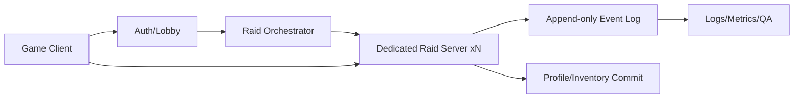

# 서버 권위 / 기술 운영 방향 초안

상태: Plan  
원천: `00_Source/00_pm_development_plan.md`, `00_Source/01_deep_research_report.md`  
목적: 기술·운영·QA 내용을 PM/기획 문서에서 분리한다.

## 서버 권위 원칙

| 항목 | 서버 확정 여부 | 이유 |
|---|---|---|
| 이동 최종 위치 | 서버 확정 | 속도핵/텔레포트 방지 |
| 히트 판정 | 서버 확정 | 에임/피해 조작 방지 |
| 피해량 | 서버 확정 | 무기/특성 조작 방지 |
| 상태이상 | 서버 확정 | DoT/스택 조작 방지 |
| 루팅 | 서버 확정 | 아이템 복사 방지 |
| 탈출 성공 | 서버 확정 | 결과 저장 악용 방지 |
| 특성 선택 | 서버 확정 | 런 빌드 조작 방지 |
| 메타 해금 | 서버 확정 | 영속 데이터 조작 방지 |

## 기본 메시지 구조

```text
Client
  → ClientInput(tick, seq, moveVec, aimDir, fire, reload, interact)
Server
  → Validate Input
  → Simulate World
  → WorldSnapshot(serverTick, entities, hp, status)
Client
  → Interpolation / UI / Effect
```

## 핵심 데이터 모델

| 모델 | 핵심 필드 | 용도 |
|---|---|---|
| Player | playerId, connectionId, hp, inventoryId, traitState | 세션 내 플레이어 상태 |
| Entity | entityId, position, rotation, hp, statusBits | 월드 오브젝트/AI/플레이어 공통 표현 |
| ItemInstance | itemInstanceId, templateId, owner, containerId, state | 루팅/소유권 무결성 |
| Raid | raidId, phase, seed, participants, extractionState | 레이드 세션 상태 |
| TraitState | selectedTraits, tags, synergies, curses | 런 빌드/시너지 계산 |
| RaidEvent | raidId, seq, eventType, payload, serverTick | 이벤트 로그/분쟁 복구/리플레이 |

## 루팅 트랜잭션 원칙

```text
Client LootRequest(itemInstanceId, containerId, requestId)
  ↓
Server Validate Distance / State / Ownership
  ↓
Server Lock Item
  ↓
Server Commit Ownership Change
  ↓
Append LootCommitted Event
  ↓
Send Ack to Client
```

완료 기준:

- 같은 아이템을 두 명이 동시에 루팅해도 하나의 결과만 확정
- 같은 requestId가 반복 전송되어도 결과 중복 적용 없음
- 탈출 실패 시 영속 저장 없음
- 탈출 성공 시 아이템이 프로필/창고에 저장

## 네트워크 초기값 제안

| 항목 | 초기값 | 이유 |
|---|---|---|
| 서버 Tick | 20~30Hz | 4~8인 탑다운 PvE + AI 기준 비용/체감 균형 |
| Snapshot | 10~20Hz | 이동 보간과 네트워크 비용 균형 |
| AOI 반경 | 25~45m 상당 | 탑다운 전투/인지 거리 기준 |
| AOI 재계산 | 0.2~0.5초 | CPU와 가시성 반응 균형 |
| 라그 보상 | 제한형, 100~150ms 후보 | PvE 중심 MVP에서 전체 리와인드 비용 절감 |

## 운영 구조



## Docker / 멀티 인스턴스 방향

- Dedicated Server Linux 빌드 자동화
- Docker 이미지 생성
- `docker compose` 또는 이후 오케스트레이터로 레이드 서버 다중 실행
- DB/로비/레이드 서버는 healthcheck 기반 준비 상태 확인
- 레이드 서버는 세션 종료 후 종료/정리되는 일회성 인스턴스 모델을 우선 검토

## 리스크와 완화책

| 리스크 | 증상 | 완화책 |
|---|---|---|
| 서버/클라 책임 혼재 | 전체 리팩토링 | 서버 권위 표를 코드 규칙으로 고정 |
| 히트 판정 불신 | 전투 품질 저하 | PvE 중심, 서버 확정 이벤트 기반 피드백 |
| 아이템 복사 | 경제 붕괴 | Item Lock, requestId, append-only event log |
| 서버 CPU 폭주 | Tick drop | AI 수 제한, AOI, 연쇄 대상 상한 |
| ESP/월핵 | 보이지 않는 정보 노출 | AOI/Interest Management로 정보 최소화 |
| 배포 레이스 | 서버 부팅 실패 | healthcheck, backoff, 준비 확인 후 세션 발급 |

## 테스트 계획 초안

| 테스트 | 기준 |
|---|---|
| 서버 접속 | 클라이언트 2개 이상 접속 가능 |
| 이동 검증 | 과속 입력 차단 |
| 발사 검증 | 서버 기준 피해 적용 |
| 루팅 검증 | 동시 루팅 시 1명만 획득 |
| 탈출 검증 | 타이머 완료 후 결과 저장 |
| 특성 검증 | 선택한 특성만 적용 |
| 스트레스 | AI 수 증가, 상태이상 다중 적용, 루팅 반복 요청, 레이드 20회 반복 |
